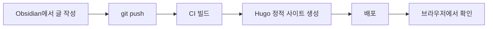
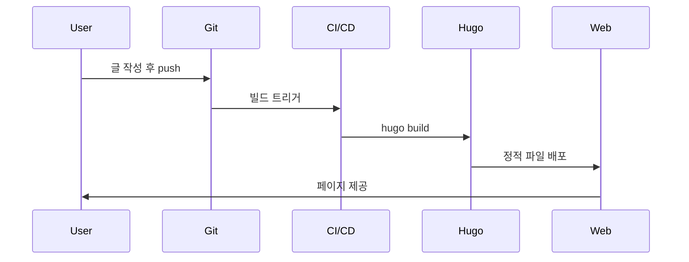

이 글은 **Hugo에서 Markdown이 어떻게 출력되는지** 빠르게 검증하기 위한 테스트 포스트입니다.  
아래 항목들이 “깨지지 않고” 잘 보이면, 글 작성/배포 파이프라인이 정상이라고 보면 됩니다.

---

## 한 줄 요약

Markdown 기본 요소 + 코드블록 + Mermaid 다이어그램이 정상 렌더링되는지 확인한다.

---

## 체크리스트

-  헤딩(H1~H3) 스타일
    
-  굵게/기울임/취소선/인라인 코드
    
-  링크 / 자동 링크
    
-  리스트(중첩 포함)
    
-  코드 블록(언어별 하이라이팅)
    
-  표(Table)
    
-  인용문(Blockquote)
    
-  이미지
    
-  Mermaid(그래프/시퀀스)
    

---

## 텍스트 스타일

**굵게**, _기울임_, ~~취소선~~, `inline code` 테스트.

링크 테스트: [https://gohugo.io/](https://gohugo.io/)

> 인용문 테스트입니다.  
> 줄바꿈/여백/폰트가 의도대로 적용되는지 확인합니다.

---

## 리스트 렌더링

1. 순서 리스트 1
    
2. 순서 리스트 2
    
    - 중첩 리스트 A
        
    - 중첩 리스트 B
        
        - 더 깊은 중첩도 확인
            

---

## 표 렌더링

|항목|값|비고|
|---|--:|---|
|빌드|성공|캐시 포함|
|배포|성공|정적 호스팅|
|댓글|giscus|iframe|

---

## 이미지 렌더링

아래 이미지는 테마가 마크다운 이미지를 어떻게 출력하는지 확인하는 용도입니다.


---

## 코드란: 코드 블록/하이라이팅 테스트

아래 코드 블록들이 “가독성 있게” 나오면 OK입니다.

### Bash

```bash
hugo server -D --disableFastRender
```

### JavaScript

```js
export function hello(name) {
  return `Hello, ${name}`;
}
console.log(hello("Hugo"));
```

### TypeScript

```ts
type Post = { title: string; tags: string[] };

const post: Post = { title: "Markdown Test", tags: ["hugo", "md"] };
```

### JSON

```json
{
  "title": "Hugo Markdown Test",
  "tags": ["hugo", "markdown", "mermaid"],
  "draft": false
}
```

### TOML (Hugo 설정 예시)

```toml
languageCode = "ko-KR"
defaultContentLanguage = "ko"
defaultContentLanguageInSubdir = false

[languages]
  [languages.ko]
    languageName = "한국어"
    weight = 1
    contentDir = "content/korean"
```

### Diff

```diff
- description: "초안"
+ description: "배포용 최종 설명"
```

---

## Mermaid 렌더링 테스트

아래 Mermaid가 **다이어그램으로 보이면** Mermaid가 정상 동작하는 상태입니다.  
만약 **그대로 코드로만 보이면**, Mermaid 로더(스크립트)나 shortcode/render hook 설정이 아직 없는 상태입니다.

### Flowchart



### Sequence Diagram



---

## Mermaid가 안 보일 때 (빠른 진단)

- Mermaid 블록이 “그대로 텍스트로” 보임 → 보통 Mermaid JS가 로드되지 않았거나, shortcode가 없음
    
- Mermaid 일부만 깨짐 → 공백/특수문자/다이어그램 문법 오류 가능
    

(필요하면 내가 네 테마에 맞춰 **Mermaid를 한 번만 로드**하거나, **Mermaid가 있는 글에서만 조건부 로드**하는 설정도 만들어줄 수 있어.)

---

## 마무리

이 글의 요소들이 전부 정상적으로 보이면,

- Markdown 작성 → Hugo 빌드 → 배포 → 브라우저 렌더링  
    흐름이 잘 동작하고 있다고 보면 됩니다.
    