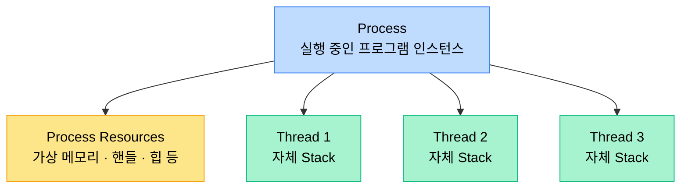
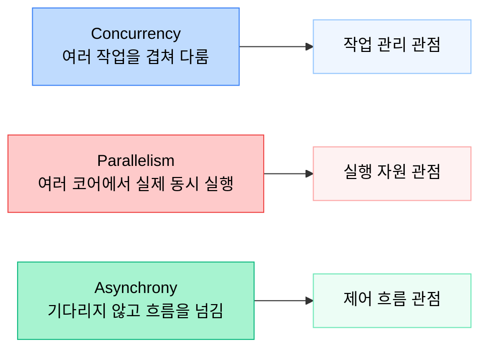
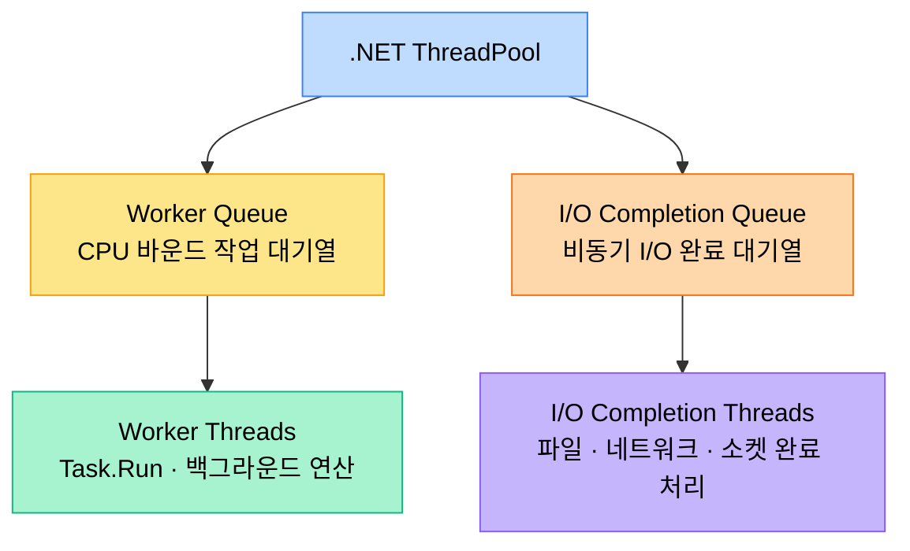
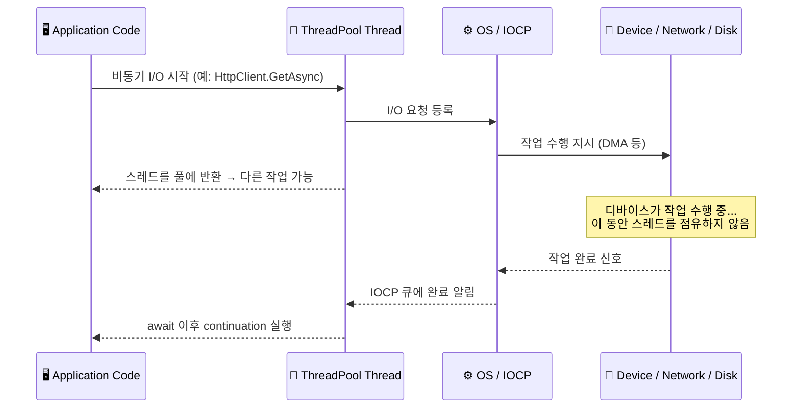
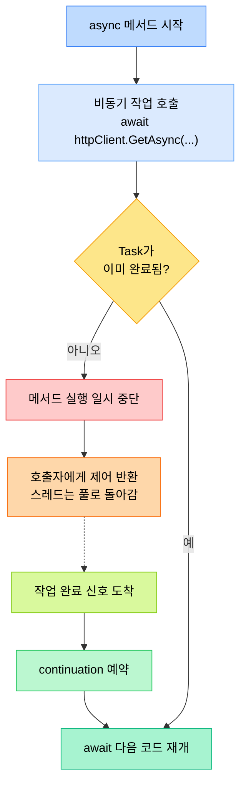
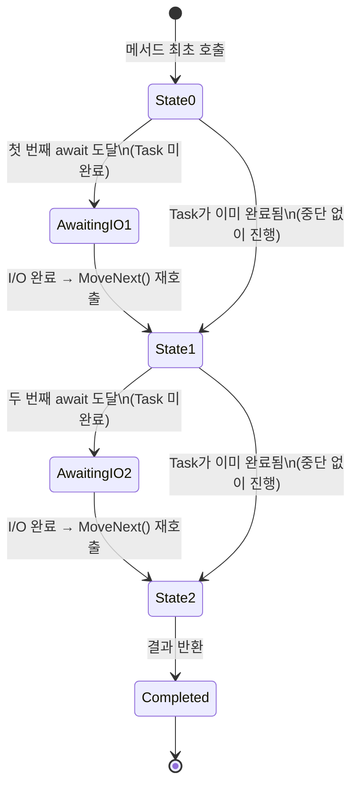
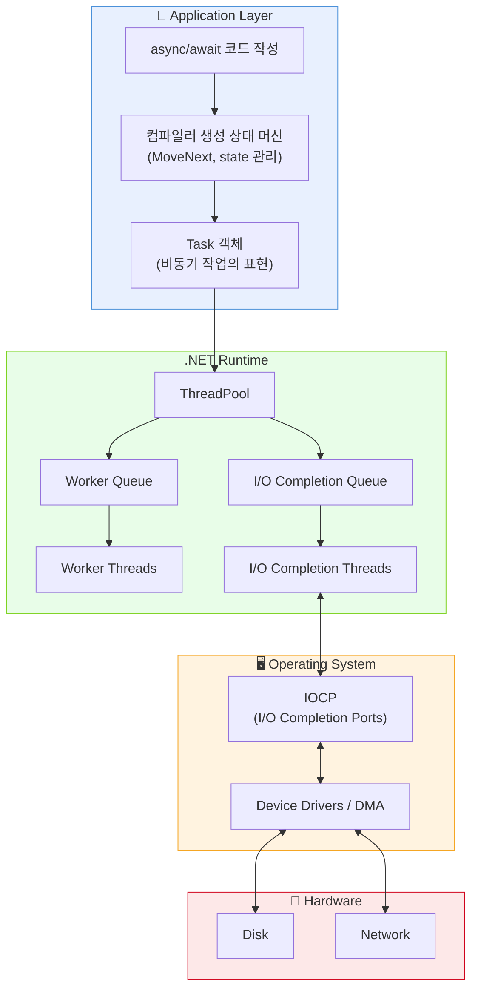

`async/await`를 처음 배울 때 흔히 드는 오해가 있다.

> *"`await`를 만나면 새 스레드가 하나 생기고, 끝나면 다시 돌아오는 것 아닌가?"*

겉으로 보면 그렇게 느껴질 수 있다. 하지만 실제로는 훨씬 더 흥미로운 일이 일어난다.

.NET의 비동기 처리는 단순히 "스레드를 바꿔 끼우는 문법"이 아니다. **스레드 풀**, **운영체제의 비동기 I/O 메커니즘**, **Task 기반 모델**, 그리고 **컴파일러가 생성하는 상태 머신**이 함께 맞물려 동작하는 구조다.

.NET의 비동기 프로그래밍은 `Task`를 중심으로 구성되며, `async` 메서드는 컴파일 시 상태 머신으로 변환되어 `await` 지점 이후의 실행을 이어갈 수 있다. 또한 관리되는 스레드 풀은 작업 실행과 비동기 I/O 완료 처리에 폭넓게 사용된다.

이 글에서는 다음 순서로 정리해 보겠다.

1. 프로세스와 스레드의 차이
2. 동시성, 병렬성, 비동기의 차이
3. .NET ThreadPool의 역할
4. I/O 작업이 끝났을 때 무엇이 이어서 실행되는지
5. `async/await`가 왜 "문법 설탕" 이상인지
6. 컴파일러가 만드는 상태 머신
7. 자주 생기는 오해 바로잡기

---

## 1. 프로세스와 스레드부터 다시 보기

모든 이야기의 출발점은 결국 **프로세스**와 **스레드**다.

**프로세스**는 실행 중인 프로그램의 인스턴스다. 운영체제는 각 프로세스에 독립적인 가상 메모리 공간과 시스템 자원을 할당한다.

**스레드**는 그 프로세스 안에서 실제 코드를 실행하는 단위다. 여러 스레드는 같은 프로세스의 힙, 핸들 같은 자원을 공유하지만, 각자 별도의 호출 스택을 가진다.

하나의 프로세스 안에 스레드가 여러 개 존재할 수 있고, 이 스레드들이 어떻게 관리되느냐에 따라 동시성, 병렬성, 비동기의 구현 방식이 달라진다.



---

## 2. 동시성, 병렬성, 비동기는 같은 말이 아니다

이 세 개념은 비슷해 보이지만 초점이 완전히 다르다. 혼동하면 설계 판단에서 자주 길을 잃게 되므로, 여기서 한 번 깔끔하게 정리하고 가자.

### 동시성 (Concurrency)

동시성은 **여러 작업을 겹쳐서 다루는 능력**에 가깝다. 꼭 물리적으로 같은 순간에 실행되지 않아도 된다. 하나의 스레드가 아주 빠르게 여러 작업을 번갈아 처리해도 동시성이라고 볼 수 있다.

식당 비유로 말하면, **한 명의 웨이터가 여러 테이블을 돌아다니며 주문을 받는 것**이다. 동시에 두 테이블에 있을 수는 없지만, 빠르게 번갈아 처리하니 손님 입장에서는 동시에 서비스받는 것처럼 느낀다.

### 병렬성 (Parallelism)

병렬성은 **여러 작업이 실제로 같은 시점에 여러 코어에서 실행되는 것**이다. CPU 연산이 많은 작업에 큰 도움이 된다.

같은 식당 비유로, **웨이터가 여러 명이어서 각자 다른 테이블을 동시에 담당하는 것**이다.

### 비동기 (Asynchrony)

비동기는 **코드의 실행 흐름을 기다림 없이 이어가도록 만드는 방식**이다. 특히 I/O 작업처럼 외부 자원을 기다리는 시간이 긴 경우, 현재 스레드를 붙잡아 두지 않고 나중에 완료되었을 때 이어서 실행하도록 구성할 수 있다.

웨이터가 주방에 주문을 넣고, **주방에서 요리가 나올 때까지 카운터 앞에서 멍하니 서 있는 대신 다른 테이블 주문을 받으러 가는 것**이다.




| 구분 | 핵심 질문 | 대표 시나리오 |
|------|----------|-------------|
| **동시성** | 여러 작업을 **어떻게 관리**하는가? | 하나의 스레드로 여러 요청 처리 |
| **병렬성** | 여러 작업을 **물리적으로 동시에** 실행하는가? | 멀티코어 CPU 연산 분산 |
| **비동기** | 기다리는 동안 **스레드를 놓아줄 수** 있는가? | 네트워크 I/O, 파일 읽기 |

---

## 3. .NET ThreadPool은 왜 중요한가

매번 새 스레드를 만들고 제거하는 것은 비용이 크다. 스레드 하나를 생성하는 데 보통 1MB 이상의 스택 메모리가 할당되고, 운영체제의 스케줄링 대상에도 추가된다.

그래서 .NET은 **관리되는 스레드 풀(Managed Thread Pool)**을 제공한다. 짧고 빈번한 백그라운드 작업은 이 풀의 스레드를 재사용함으로써 오버헤드를 크게 줄일 수 있다.

.NET 문서에 따르면 ThreadPool은 작업 처리량을 최적화하기 위해 스레드를 생성·관리하며, `Task`, 비동기 I/O 완료, 타이머 콜백, 일부 소켓 작업 등 다양한 곳에서 사용된다.

### Worker Thread vs I/O Completion Thread

ThreadPool 안의 스레드는 크게 두 가지 용도로 나뉜다. 운영체제 차원에서 완전히 다른 실체라기보다, .NET이 스레드 풀 안에서 **어떤 용도로 쓰는가**의 차이에 가깝다.

**Worker Thread**
- `Task.Run`, 큐잉된 작업, 일반적인 백그라운드 실행처럼 **CPU 작업을 처리하는 쪽**

**I/O Completion Port Thread**
- Windows에서 비동기 I/O 완료 알림을 처리하는 데 연결되는 스레드
- 파일, 네트워크, 소켓 등의 비동기 작업이 끝났을 때 그 완료 신호를 받아 후속 처리를 이어감




코드로 확인해보면 이렇다:

```csharp
ThreadPool.GetAvailableThreads(out int workerThreads, out int completionPortThreads);
Console.WriteLine($"Worker: {workerThreads}, IO: {completionPortThreads}");
```

---

## 4. I/O 작업은 왜 스레드를 덜 묶어 두는가

비동기 I/O를 이해할 때 가장 중요한 포인트는, **CPU가 매 순간 직접 데이터를 옮기고 기다리는 구조가 아니라는 점**이다.

현대 시스템에서는 운영체제와 장치 드라이버, DMA(Direct Memory Access) 같은 메커니즘을 통해 I/O가 진행된다. CPU는 "이 작업 해줘"라고 요청만 하고 다른 일을 할 수 있다. 작업이 완료되면 운영체제가 애플리케이션에 완료 사실을 알려준다.

Windows에서는 이 완료 알림 처리에 **IOCP(I/O Completion Ports)**가 쓰인다. Windows 문서는 IOCP를 "다중 프로세서 시스템에서 여러 비동기 I/O 요청을 효율적으로 처리하기 위한 스레딩 모델"이라고 설명한다.

### 동기 I/O vs 비동기 I/O

**동기 방식**: 스레드가 I/O 요청을 보내고, 결과가 올 때까지 **그 자리에서 대기**한다. 그동안 해당 스레드는 아무것도 할 수 없다.

**비동기 방식**: 스레드가 I/O 요청을 보내고, 곧바로 **풀로 반환**된다. 결과가 오면 완료 알림이 큐에 들어가고, 가용한 스레드가 꺼내서 후속 작업을 처리한다.



이것이 웹 서버 같은 환경에서 `async/await`가 가치 있는 핵심 이유다. 개별 요청을 마법처럼 더 빨리 끝내주는 게 아니라, **같은 스레드 자원으로 더 많은 요청을 동시에 감당할 수 있게 해 주는 것**이다.

---

## 5. async/await는 무엇을 해 주는가

`async/await`의 가장 큰 장점은 **비동기 코드를 동기 코드처럼 읽히게 만든다**는 점이다.

### 코드로 보는 차이

**async/await 없이 (콜백 방식 의사코드)**
```csharp
void GetDataOldWay()
{
    httpClient.GetAsync("https://api.example.com/data")
        .ContinueWith(responseTask =>
        {
            var response = responseTask.Result;
            response.Content.ReadAsStringAsync()
                .ContinueWith(contentTask =>
                {
                    var content = contentTask.Result;
                    ProcessData(content);
                });
        });
}
```

**async/await 사용**
```csharp
async Task GetDataAsync()
{
    var response = await httpClient.GetAsync("https://api.example.com/data");
    var content = await response.Content.ReadAsStringAsync();
    ProcessData(content);
}
```

같은 비동기 흐름이지만, `await` 버전은 위에서 아래로 읽기만 하면 된다. 중첩된 콜백 지옥이 사라진다.

### await는 "새 스레드를 만든다"는 뜻이 아니다

여기서 중요한 점은 `await`가 곧바로 새 스레드를 만든다는 뜻이 아니라는 것이다. `await`의 동작은 다음과 같다:

1. 대기하는 `Task`가 **이미 완료**되었으면 → 그냥 다음 줄로 넘어간다 (스레드 전환 없음)
2. 아직 **완료되지 않았으면** → 현재 메서드 실행을 일시 중단하고, 호출자에게 제어를 반환한다
3. 나중에 `Task`가 완료되면 → **continuation**이 예약되어, 가용한 스레드에서 이어서 실행된다




---

## 6. 상태 머신 — 컴파일러가 하는 진짜 일

`async` 메서드를 작성하면, C# 컴파일러는 이를 내부적으로 **상태 머신(State Machine)**으로 변환한다. 이것이 `async/await`가 "문법 설탕" 이상인 이유다.

### 왜 상태 머신이 필요한가

일반 메서드는 호출 스택 위에서 한 번에 쭉 실행된다. 하지만 `async` 메서드는 **중간에 멈췄다가 나중에 다시 이어가야** 한다. 이때 다음 정보들을 어딘가에 보관해야 한다:

- 로컬 변수의 현재 값
- 어떤 `await` 지점까지 실행했는지
- 다음에 어디서 재개해야 하는지

컴파일러는 이 정보를 담는 **구조체(또는 클래스)**를 자동 생성하고, 각 `await` 지점을 상태(state) 번호로 관리한다.

### 개념적 변환 예시

우리가 작성하는 코드:
```csharp
async Task<string> FetchDataAsync()
{
    var response = await httpClient.GetAsync("https://api.example.com");
    var content = await response.Content.ReadAsStringAsync();
    return content;
}
```

컴파일러가 대략적으로 만드는 구조 (단순화):
```csharp
struct FetchDataAsyncStateMachine : IAsyncStateMachine
{
    public int state;  // 현재 상태 번호
    public HttpResponseMessage response;  // 로컬 변수 보관
    public string content;
    public AsyncTaskMethodBuilder<string> builder;

    public void MoveNext()
    {
        switch (state)
        {
            case 0:
                // httpClient.GetAsync 호출 후 await
                state = 1;
                var awaiter1 = httpClient.GetAsync("...").GetAwaiter();
                if (!awaiter1.IsCompleted)
                {
                    builder.AwaitUnsafeOnCompleted(ref awaiter1, ref this);
                    return;  // 여기서 빠져나감 (중단)
                }
                goto case 1;

            case 1:
                response = awaiter1.GetResult();
                // ReadAsStringAsync 호출 후 await
                state = 2;
                var awaiter2 = response.Content.ReadAsStringAsync().GetAwaiter();
                if (!awaiter2.IsCompleted)
                {
                    builder.AwaitUnsafeOnCompleted(ref awaiter2, ref this);
                    return;  // 여기서 빠져나감 (중단)
                }
                goto case 2;

            case 2:
                content = awaiter2.GetResult();
                builder.SetResult(content);
                return;
        }
    }
}
```

핵심은 **`MoveNext()`가 여러 번 호출될 수 있다**는 것이다. 각 호출마다 `state` 값을 확인하고, 해당 지점부터 이어서 실행한다.



---

## 7. 자주 생기는 오해 바로잡기

### ❌ 오해 1: async는 무조건 새 스레드를 만든다

**사실**: `async/await`의 핵심은 스레드를 만드는 것이 아니라, **메서드를 중단하고 나중에 이어서 실행할 수 있게 만드는 것**이다. CPU 바운드 작업을 별도 스레드로 보내고 싶을 때는 `Task.Run`이라는 별도의 선택이 필요하다.

```csharp
// ❌ async만으로 새 스레드가 생기는 게 아니다
async Task DoSomethingAsync()
{
    await Task.Delay(1000);  // 타이머 기반, 스레드 점유 없음
}

// ✅ CPU 작업을 별도 스레드로 보내려면 명시적으로
await Task.Run(() => HeavyCpuWork());
```

### ❌ 오해 2: async를 쓰면 무조건 더 빨라진다

**사실**: 단일 작업 하나의 절대 실행 시간이 짧아지는 게 아니다. 대기 중인 스레드를 줄여 **확장성(Scalability)**을 개선하는 방향에 가깝다.

| 시나리오 | async의 효과 |
|---------|------------|
| 웹 서버에서 수천 개 동시 요청 처리 | ✅ 스레드 절약으로 처리량 향상 |
| 단일 CPU 연산 하나를 빨리 끝내기 | ❌ 효과 없음 (오히려 오버헤드) |
| I/O 대기가 많은 파이프라인 | ✅ 대기 시간 동안 자원 활용 |

### ❌ 오해 3: 병렬성과 비동기는 같은 말이다

**사실**: 비동기는 **기다림을 효율적으로 다루는 제어 흐름**이고, 병렬성은 **여러 코어에서 실제 연산을 동시에 수행하는 실행 전략**이다.

```csharp
// 비동기: I/O 대기 동안 스레드를 놓아줌
var data = await httpClient.GetStringAsync("https://...");

// 병렬성: CPU 작업을 여러 코어에 분산
Parallel.ForEach(items, item => ProcessItem(item));
```

---

## 전체 그림 — 모든 조각을 합치면

지금까지 다룬 내용을 하나의 흐름으로 연결하면 이렇다:



---

## 마무리

정리하면, `.NET의 async/await`는 단순한 편의 문법이 아니다.

그 뒤에는 다음 요소들이 함께 작동한다:

| 계층 | 역할 |
|------|------|
| **ThreadPool** | 작업을 재사용 가능한 스레드에 실어 보냄 |
| **OS / IOCP** | 비동기 I/O 완료를 효율적으로 알림 |
| **Task** | 비동기 작업의 상태와 결과를 표현 |
| **상태 머신** | `await` 지점 이후를 이어서 실행할 수 있도록 컨텍스트를 보관 |

이 구조를 이해하면 다음 질문들에 훨씬 명확하게 답할 수 있게 된다:

- **왜 ASP.NET Core에서 동기 I/O를 오래 붙잡는 코드가 문제인가?** → 스레드 풀 고갈
- **왜 `Task.Run`을 남발하면 안 되는가?** → 불필요한 Worker Thread 점유
- **왜 `async/await`가 확장성 측면에서 중요한가?** → 같은 스레드로 더 많은 요청 처리

비동기 프로그래밍은 처음에는 마법처럼 보이지만, 한 겹씩 벗겨 보면 결국 **스레드 관리**, **OS의 I/O 처리**, **컴파일러의 코드 변환**이라는 아주 구체적인 메커니즘의 조합이다. 그리고 그 메커니즘을 이해하는 순간, `await`가 더 이상 블랙박스가 아니게 된다.

---

## 참고한 글

- Ahmed Fawzi, *"Inside .NET Asynchrony and Concurrency: Threads and Thread Pool, How I/O Work Is Done, Completion Ports, Async/Await, State Machine — The Complete Journey in Detail."*, Medium, 2025-05-09. ([원문 링크](https://medium.com/@ahmedfawzielarabi98/inside-net-asynchrony-and-concurrency-threads-and-thread-pool-how-i-o-work-is-done-completion-10a260bd70b7))
- Microsoft Learn, [Asynchronous programming with async and await](https://learn.microsoft.com/en-us/dotnet/csharp/asynchronous-programming/)
- Microsoft Learn, [The managed thread pool](https://learn.microsoft.com/en-us/dotnet/standard/threading/the-managed-thread-pool)
- Microsoft Learn, [Asynchronous programming scenarios](https://learn.microsoft.com/en-us/dotnet/csharp/asynchronous-programming/async-scenarios)
- Microsoft Learn, [I/O Completion Ports (Win32)](https://learn.microsoft.com/en-us/windows/win32/fileio/i-o-completion-ports)

> 이 글은 위 원문을 읽고 핵심 개념을 필자가 다시 이해한 방식으로 재구성한 해설 글입니다. 원문의 문장, 도표, 이미지를 그대로 번역·재게시하지 않았으며, 설명용 다이어그램은 Mermaid로 새롭게 작성했습니다.